# Welcome to Tahara Backend Documentation

## Mission Statement

Tahara is a comprehensive women's health platform designed to break menstrual health taboos in Arab society. Our mission is to provide women with the knowledge, tools, and support they need to understand and manage their reproductive health with confidence and dignity.

## System Overview

Tahara combines menstrual cycle tracking, pregnancy monitoring, symptom management, educational content, e-commerce capabilities, and AI-powered assistance into a unified platform that serves women throughout their reproductive journey.

## User Flows and Stakeholder Journey

### 👥 User Registration & Authentication Flow

```mermaid
graph LR
    A[👩 New User Registration] --> B{🔍 Mobile/Email}
    B -->|Mobile OTP| C[📱 WhatsApp/SMS Verification]
    B -->|Social| D[🔐 Apple/Google Login]
    C --> E[✅ Account Created]
    D --> E
    E --> F{👤 Profile Setup}
    F --> G[📋 Age & Birthdate Entry]
    G --> H{🎯 Goal Selection}
    H --> I[📊 Follow Cycle]
    H --> J[🤰 Be Pregnant]
    H --> K[🤱 Follow Pregnancy]
    
    classDef userNode fill:#e8f5e8,stroke:#1b5e20,stroke-width:3px,color:#000
    classDef processNode fill:#e3f2fd,stroke:#0d47a1,stroke-width:2px,color:#000
    classDef goalNode fill:#fff3e0,stroke:#e65100,stroke-width:2px,color:#000
    
    class A,E userNode
    class B,C,D,F,G processNode
    class I,J,K goalNode
```

### 📊 Health Tracking & Monitoring

#### 📈 Cycle Tracking Features

```mermaid
graph LR
    subgraph "📈 Cycle Management"
        A[📊 Cycle Tracking] --> B[💊 Symptom Logging]
        B --> C[🔮 Cycle Predictions]
        C --> D[📅 Calendar View]
    end
    
    classDef trackingNode fill:#e8f5e8,stroke:#1b5e20,stroke-width:3px,color:#000
    
    class A,B,C,D trackingNode
```

#### 🤰 Pregnancy Planning Journey

```mermaid
graph LR
    subgraph "🤰 Pregnancy Planning"
        E[🎯 Fertility Optimization] --> F[📋 Pre-conception Care]
        F --> G[🩺 Medical Support]
    end
    
    classDef pregnancyNode fill:#f3e5f5,stroke:#4a148c,stroke-width:3px,color:#000
    
    class E,F,G pregnancyNode
```

#### 🤱 Pregnancy Monitoring System

```mermaid
graph LR
    subgraph "🤱 Pregnancy Monitoring"
        H[📖 Weekly Guidance] --> I[👶 Baby Development]
        I --> J[🏥 Healthcare Support]
    end
    
    classDef monitoringNode fill:#fff3e0,stroke:#e65100,stroke-width:3px,color:#000
    
    class H,I,J monitoringNode
```

### 🛒 E-commerce & Shopping Experience

```mermaid
graph LR
    subgraph "🛒 Salla Store Integration"
        A[🛍️ Product Browsing] --> B[🔐 Privacy Shopping]
    end
    subgraph "💰 Order Management"
        B --> C[🛒 Cart Management]
        C --> D[💳 Secure Checkout]
        D --> E[📦 Discreet Delivery]
    end
    
    classDef ecommerceNode fill:#fff3e0,stroke:#e65100,stroke-width:3px,color:#000
    classDef shoppingNode fill:#f3e5f5,stroke:#4a148c,stroke-width:2px,color:#000
    
    class A,B ecommerceNode
    class C,D,E shoppingNode
```

### 📚 Educational Content & AI Assistant

```mermaid
graph LR
    subgraph "📚 Educational Hub"
        A[👩‍⚕️ Doctor Articles] --> B[🎥 Video Content]
        B --> C[📖 Health Guides]
    end
    subgraph "🤖 AI Assistant"
        C --> D[💬 Personalized Chat]
        D --> E[🔍 Content Discovery]
    end
    
    classDef educationNode fill:#e3f2fd,stroke:#0d47a1,stroke-width:3px,color:#000
    classDef aiNode fill:#f1f8e9,stroke:#33691e,stroke-width:2px,color:#000
    
    class A,B,C educationNode
    class D,E aiNode
```

### 🎮 Gamification & Engagement

```mermaid
graph LR
    subgraph "🎯 Puzzle System"
        A[🧩 Daily Puzzles] --> B[🏆 Rewards & Coupons]
        B --> C[💸 Store Discounts]
    end
    
    classDef puzzleNode fill:#fff3e0,stroke:#e65100,stroke-width:3px,color:#000
    
    class A,B,C puzzleNode
```

## Age-Based Content System

**🔞 Age Verification & Content Filtering:**
- **Under 18 Users**: Access to age-appropriate educational content only
- **18+ Users**: Full platform access including e-commerce and sensitive health topics
- **Automatic Transition**: System automatically upgrades user access on 18th birthday

## Technical Architecture

### Core Technology Stack
- **Backend Framework**: Laravel 10.x
- **PHP Version**: ^8.1
- **Database**: MySQL with migrations
- **Admin Panel**: Filament 2.x
- **Authentication**: Laravel Sanctum
- **Queue System**: Laravel Horizon with Redis
- **File Storage**: Google Cloud Storage
- **Real-time Features**: Pusher WebSockets

### Third-Party Integrations

#### 🛒 **E-commerce & Payment**
- **Salla API**: Complete e-commerce platform integration
- **OAuth2**: Secure customer authentication with Salla
- **Webhook System**: Real-time order and product synchronization

#### 📱 **Mobile & Analytics**
- **Apple Services**: App Store Connect API, Apple Analytics
- **Google Services**: Google Cloud Storage, Google Play Console, Firebase
- **Analytics**: App download tracking and user behavior analysis

#### 💬 **Communication & AI**
- **Cequens**: SMS and WhatsApp OTP services
- **OpenAI Integration**: AI-powered chat assistant
- **Push Notifications**: Firebase Cloud Messaging

#### 🔧 **Development & Monitoring**
- **Sentry**: Error tracking and monitoring
- **Horizon**: Queue monitoring and management
- **Activity Logging**: User action tracking with Spatie

## Key Stakeholders

### 👩‍💼 **Primary Users**
- **Teenage Girls (Under 18)**: Cycle tracking with age-appropriate content + full store access
- **Adult Women (18+)**: Complete health tracking with full sensitive content access
- **Women Trying to Conceive**: Ovulation tracking and fertility planning
- **Pregnant Women**: Week-by-week pregnancy monitoring and guidance

### 👨‍⚕️ **Healthcare Professionals**
- **Doctors**: Content creation and medical review of articles
- **Medical Reviewers**: Verification of health information accuracy

### 🛠️ **Administrative Users**
- **System Administrators**: User management and platform oversight
- **Content Managers**: Article and campaign management
- **Customer Support**: User assistance and issue resolution

## Salla E-commerce Integration

### 🛍️ **Complete Shopping Experience**
- **Product Catalog**: Real-time synchronization with Salla store
- **Privacy-Focused**: Discreet browsing and purchasing
- **Secure Payments**: Multiple payment methods with encryption
- **Order Management**: Complete order lifecycle tracking
- **Delivery System**: Unmarked packaging for user privacy

### 📊 **Business Features**
- **Inventory Management**: Real-time stock updates via webhooks
- **Customer Accounts**: Integrated user profiles with purchase history
- **Analytics**: Sales and user behavior tracking
- **Coupon System**: Automated discount and reward management

## Data Privacy & Security

### 🔒 **Security Measures**
- **Data Encryption**: All sensitive data encrypted at rest and in transit
- **Role-Based Access**: Granular permission system for different user types
- **API Security**: Rate limiting and authentication for all endpoints
- **Audit Logging**: Complete user action tracking for compliance

### 🌍 **Cultural Sensitivity**
- **Localization**: Full Arabic and English language support
- **Cultural Awareness**: Content designed for Middle Eastern cultural context
- **Privacy Protection**: Enhanced privacy features for sensitive health data

## Documentation Navigation

This documentation is organized into several key sections:

- **📋 Overviews**: Detailed model documentation and system architecture
- **🔧 Workflows**: Business process documentation and system workflows
- **🔗 API Reference**: Complete API endpoint documentation
- **⚙️ Configuration**: System setup and configuration guides

Each section provides comprehensive information about different aspects of the Tahara platform, making it easy for developers, administrators, and stakeholders to understand and work with the system. 